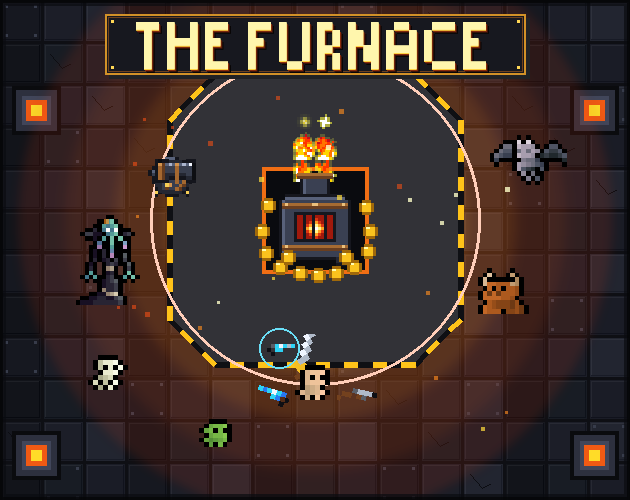
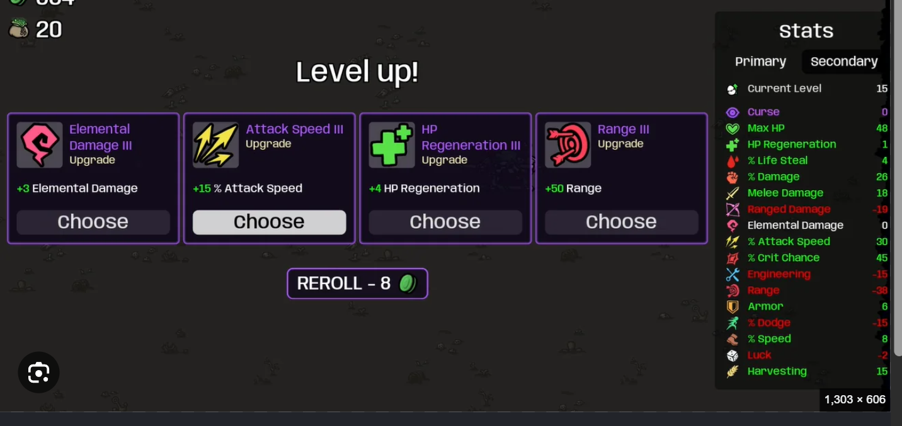

# 🔥 The Furnace

<div align="center">



[](https://godotengine.org)
[](LICENSE)
[](#)

*An intense top-down action roguelike / base defense game built with Godot 4.*

</div>

---

## 🎮 Overview

In **The Furnace**, you stand as the last defender of an ancient, volatile core. Waves of relentless monsters descend upon you. Collect bones from fallen foes, haul them to The Furnace, and smelt them into gold to purchase weapons, skills, and automated defense turrets.

Manage the heat: the hotter the furnace burns, the richer the payout—but let it overheat, and a devastating meltdown awaits!



---

## ⚡ Key Features

- **🔥 Heat & Meltdown Dynamics**: Balance risk and reward. High temperature multiplies gold payout, but exceeding critical limits triggers dangerous overheat states.
- **💦 Hydro Cooling Cannon**: Spray the furnace with your water stream to cool it down, or blast oncoming monster hordes to slow their assault.
- **💀 Wave Survival & Boss Encounters**: Survive 20 escalating waves featuring swarms, elite variants, and menacing bosses.
- **🛠️ Defense Turret System**: Buy and place permanent automated defensive turrets (Ballistas, Heavy Cannons, Flame Turrets, Ice Turrets) to secure choke points.
- **⚔️ Deep Arsenal & Skill Trees**: Equip diverse weapon types, unlock active skills (Shields, Damage Boosts), and customize passives on every level-up.
- **⚡ High-Octane Movement**: Dash through danger with invulnerability frames, maintain kill combos for multiplier bonuses, and lock onto priority targets.
- **🎚️ Multiple Difficulties**: Tailor your challenge with Easy, Normal, and Hard modes.

---

## 🕹️ Controls

| Action | Keyboard & Mouse |
| :--- | :--- |
| **Move** | `W`, `A`, `S`, `D` or Arrow Keys |
| **Aim & Shoot** | Mouse Pointer + `Left Mouse Button` |
| **Dash / Evade** | `Spacebar` |
| **Interact / Smelt Bones** | `E` |
| **Cool Furnace (Water Cannon)** | `F` (or aim and spray water) |
| **Toggle Fullscreen** | `F11` or `Alt` + `Enter` |
| **Pause Menu** | `Escape` |

*Touch controls are also natively supported for mobile/browser platforms.*

---

## 🚀 Getting Started & Development

### Prerequisites
- [Godot Engine 4.x](https://godotengine.org/download) (Compatibility / Forward+ renderer supported)

### Running from Source
1. Clone this repository:
   ```bash
   git clone https://github.com/Difajoz/the-furnace.git
   ```
2. Open Godot Engine and click **Import**.
3. Navigate to the cloned folder and select `project.godot`.
4. Click **Import & Edit**.
5. Press `F5` to run the game!

---

## 📂 Project Structure

```text
the-furnace/
├── assets/          # Sprites, audio, fonts, and particle textures
├── scenes/          # UI, player, enemies, furnace, and main game levels
│   ├── hud.tscn
│   ├── shop_ui.tscn
│   ├── level_up_ui.tscn
│   └── main.tscn
├── scripts/         # GDScript logic
│   ├── globals/     # Autoload singletons (GameManager, ItemDatabase, SoundManager)
│   ├── entities/    # Player, enemy AI, boss patterns, turrets
│   └── ui/          # UI controllers and menus
├── project.godot    # Engine settings and input map
└── export_presets.cfg # Pre-configured export settings for Windows, Web, macOS
```

---

## 📜 License

This project is licensed under the MIT License - feel free to build upon and modify for your own projects.
